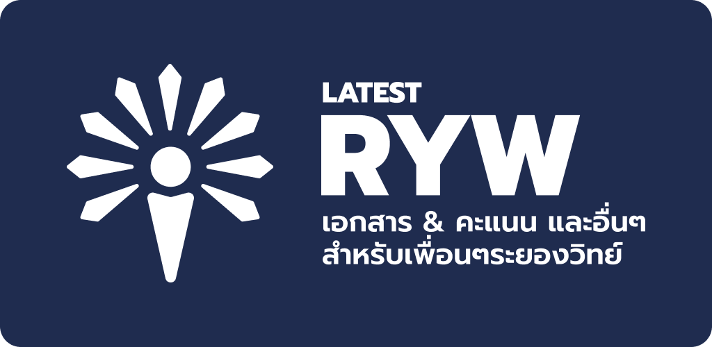

<div align="center">



# RYW Latest | ล่าสุด ระยองวิทย์
เป็นคนแรกที่ได้ข่าวระยองวิทย์!

</div>

RYW Latest เป็นแอพพลิเคชั่นสำหรับข่าวประชาสัมพันธ์ และอื่นๆ สำหรับเพื่อนๆ ในระยองวิทย์ (หลัก) ทุกคน ทำงานผ่าน [Web scraping](https://en.wikipedia.org/wiki/Web_scraping) เป็นหลัก รันบน [Framework7](https://framework7.io/)

## Setup
| โปรแกรม | ดาวน์โหลด |
|--|--|
| NodeJS | https://nodejs.org/en/ |
| npm | ลงพร้อมกับ NodeJS |
| Android Studio & SDK | https://developer.android.com/studio |

1. โคลน
```sh
git clone https://github.com/SK-Fast/rywlatest.git
```

2. ลง Packages แล้ว Sync กับ Capacitor
```sh
npm install
npx cap sync
```

3. เปิด Android Studio
```sh
npx cap open android
```

4. ต่อ Emulator หรือ Device USB แล้ว รัน Project บน Android Studio

5. เปิด Test Server
```sh
npm run dev
```

<div align="center">

[himaji.xyz](https://himaji.xyz)
•
[rayongwit.ac.th](https://rayongwit.ac.th)

</div>